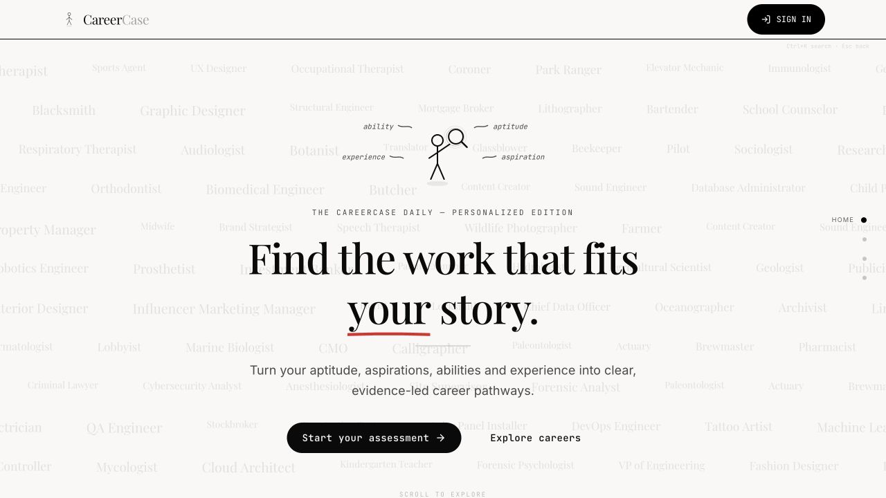

# CareerCase

**Explainable career matching and pathway planning for India.**

[](https://careercase.pages.dev/)
[](https://github.com/KamalReddy2901/AI-Enhanced-Career-Guidance-System-for-Personalized-Career-Pathways/actions/workflows/ci.yml)
[](LICENSE)
[](https://www.typescriptlang.org/)

> A career decision should show its work. CareerCase turns a person's interests, aptitudes, values, skills, experience, aspirations, and constraints into ranked career matches, visible evidence, and practical next steps.

**[Open the live product →](https://careercase.pages.dev/)**



CareerCase is a functional prototype for Smart India Hackathon 2026 problem statement **SIH260480**. Its core matching and pathway logic is deterministic and versioned; generative AI is used only for assisted exploration, extraction, and explanation.

## What the prototype demonstrates

`Profile → Understand → Match → Plan → Progress`

- A living **Career Passport** with evidence and confidence attached to skill claims.
- Four **exploratory assessments** covering RIASEC interests, aptitude signals, work values, and aspirations.
- A transparent **11-component recommendation engine** with a “Why this?” breakdown for every match.
- A visual **Career Landscape** that compares fit, transition ease, and reward potential.
- Exactly **three pathways per occupation**: focused, lower-risk, and credential-first.
- Skill-gap analysis, qualification/provider discovery, saved plans, and progress tracking.
- Optional AI-assisted dossiers, simulations, interview practice, and grounded counseling.

## Product boundaries

| Area | Current prototype | Important boundary |
|---|---|---|
| Career matching | Deterministic, 11-component weighted scoring | A match score is a fit index, not a probability of placement or success |
| Assessments | Structured exploratory screeners | Psychometric and multilingual validation are still pending |
| Market signals | Versioned `2025-H2` indicative snapshot | Not real-time vacancy or authoritative labour-statistics data |
| AI | On-demand extraction, dossiers, simulations, and counseling | AI does not set or alter the deterministic match score |
| Privacy controls | Explicit consent, JSON export, deletion, RLS-backed cloud persistence | Formal DPDP legal/compliance review is pending |
| Government integrations | NCO/NSQF-aligned data model and proposed interface contracts | SIDH, NCS, DigiLocker, and PMKVY connectors are not implemented |

## Knowledge base

The checked-in knowledge base is versioned as `kb-2026.06.1` and validated in CI.

| Entity | Count |
|---|---:|
| Occupations | 100 |
| Skills | 178 |
| Qualifications | 105 |
| Occupation transitions | 300 |
| Market signals | 100 |
| Vocational entry roles | 61 |

The data is a curated demonstration dataset grounded in NCO-2015 codes and NSQF levels. Demand and salary signals are indicative, not live statistics.

## Architecture

- **Client:** React 18, TypeScript, React Router 7, Vite 6, Tailwind CSS 4.
- **Guidance engine:** versioned TypeScript knowledge modules and deterministic scoring/pathway functions.
- **Persistence:** browser-local fallback plus optional Supabase Auth/PostgreSQL with row-level security.
- **AI gateway:** optional Cloudflare Worker proxy to Groq, with authenticated requests, model-tier routing, key rotation, quarantine, and retry policies.
- **AI models:** `openai/gpt-oss-20b` for lighter tasks and `openai/gpt-oss-120b` for more complex tasks.
- **Hosting:** Cloudflare Pages for the client and Cloudflare Workers for the optional AI gateway.

## Run locally

### Prerequisites

- Node.js `22.16.0` (see [`.node-version`](./.node-version)).
- npm.
- Optional: Supabase project for sign-in and cross-device persistence.
- Optional: Cloudflare and Groq accounts for AI-assisted features.

### Install and start

```bash
git clone https://github.com/KamalReddy2901/AI-Enhanced-Career-Guidance-System-for-Personalized-Career-Pathways.git
cd AI-Enhanced-Career-Guidance-System-for-Personalized-Career-Pathways
npm ci

cp .env.example .env.local
npm run dev
```

The deterministic guidance flow works without AI credentials. Without Supabase configuration, profile data uses the browser-local fallback.

### Client environment

```env
# Optional: account authentication and cloud persistence
VITE_SUPABASE_URL=https://your-project-ref.supabase.co
VITE_SUPABASE_ANON_KEY=your_supabase_anon_key

# Optional: Worker origin only; the client appends /ai
VITE_AI_PROXY_URL=https://your-worker.workers.dev

# Development-only direct Groq fallback; never use in a production build
# VITE_GROQ_API_KEYS=gsk_...
```

Keep secrets out of `VITE_*` variables: Vite exposes them to the browser. The Supabase anonymous key is designed to be public when appropriate RLS policies are enabled; Groq keys belong in Worker secrets.

For full account-backed persistence, run both migrations in the Supabase SQL editor: first [`supabase-migration.sql`](./supabase-migration.sql) for exploration history and favorites, then [`supabase-guidance-migration.sql`](./supabase-guidance-migration.sql) for the Career Passport, assessments, plans, and consent records.

### Optional AI Worker

The repository includes a safe Worker configuration plus [`worker/wrangler.toml.example`](./worker/wrangler.toml.example).

```bash
cd worker
npm ci

# Set encrypted Worker secrets interactively
npx wrangler secret put GROQ_API_KEYS
npx wrangler secret put SUPABASE_URL
npx wrangler secret put SUPABASE_ANON_KEY

npm test
npm run deploy
```

`GROQ_API_KEYS` accepts a comma-separated key pool. After deployment, set `VITE_AI_PROXY_URL` to the Worker origin and rebuild the client.

## Quality checks

```bash
npm run typecheck
npm run kb:validate
npm run qa:guidance
npm run qa:guidance-regression
npm run qa:product
npm run qa:trending
npm run build

cd worker
npm test
npx tsc --noEmit
```

GitHub Actions runs these checks for pushes and pull requests. The current automated suite covers knowledge-base integrity, completeness contracts, deterministic regression behavior, product invariants, trend normalization, and Worker key/retry policy behavior. Full browser automation, formal accessibility testing, security review, and field validation remain future work.

## Demo journey

For a concise product walkthrough:

1. Open the Career Passport and show the evidence-backed profile.
2. Open Career Landscape and compare the ranked recommendations.
3. Select **Why this?** to show the 11 scoring components and sources.
4. Open one career and compare its three pathway routes.
5. Show the skill gap, qualification/provider options, and a progress step.
6. Use a pre-generated dossier or counselor response only if time allows.

## Repository map

```text
src/app/engine/          deterministic scoring, passport, gap, and pathway logic
src/app/data/knowledge/  versioned occupations, skills, qualifications, and market signals
src/app/pages/           product surfaces and assessment flows
src/app/services/        Supabase persistence and optional AI integrations
scripts/                 deterministic product and regression QA
worker/                  authenticated Cloudflare AI gateway and tests
others/                  archived research, presentation, and implementation artifacts
```

## Readiness

CareerCase is **demo-ready and suitable for controlled prototype evaluation**. It is not yet production-ready: psychometric validation, representative field pilots, WCAG 2.2 AA verification, formal privacy/security review, live labour-market integrations, and government connector agreements are pending.

## License and contact

Released under the [MIT License](./LICENSE). Maintained by [Kamal Reddy](https://github.com/KamalReddy2901).

Issues and feature requests are welcome in the [public issue tracker](https://github.com/KamalReddy2901/AI-Enhanced-Career-Guidance-System-for-Personalized-Career-Pathways/issues).

---

**Disclaimer:** CareerCase is an exploratory prototype, not a diagnostic instrument or a substitute for a qualified career counselor. Validate recommendations, course/provider details, salary estimates, and market signals before making a major education or career decision.
